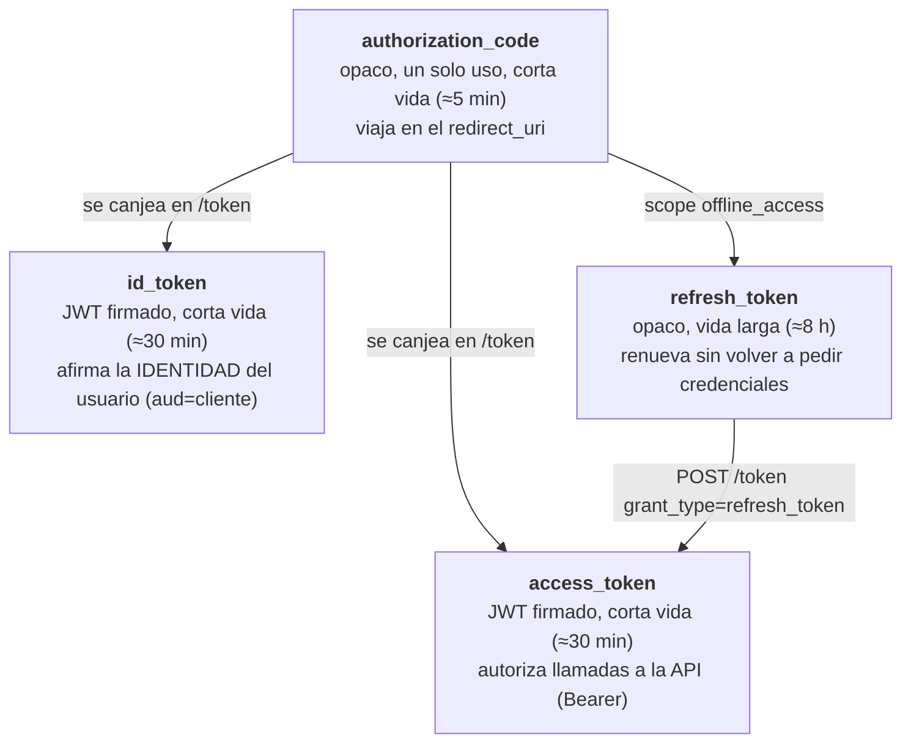
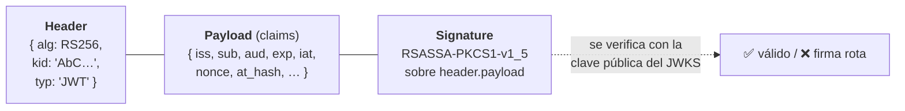

# 01 · Actores y tokens

Antes de seguir un flujo hay que fijar quién es quién y qué viaja por el cable. Este documento es el
vocabulario que usan los demás.

## 🟦 Teoría

OAuth 2.0 (RFC 6749) define **cuatro** roles:

| Rol | Quién es | En un login típico |
| --- | --- | --- |
| **Resource Owner** | El dueño de los datos | 👤 la persona |
| **Client** | La aplicación que quiere acceder | la SPA o el back-end |
| **Authorization Server (AS)** | Emite los tokens tras autenticar y autorizar | el OP |
| **Resource Server (RS)** | Sirve los datos protegidos y valida el token | tu API |

OpenID Connect **añade la capa de identidad** encima de OAuth: el AS pasa a llamarse **OpenID
Provider (OP)** y aparece un token nuevo, el `id_token`, que es un **JWT firmado** con la identidad
del usuario. OAuth responde *"¿este cliente puede hacer esto?"***;** OIDC responde además
*"¿quién es esta persona?"*.

### Los cuatro tokens del flujo

- **authorization_code**: no contiene información, es una *referencia*. Se canjea con el
  `code_verifier` de PKCE y **solo sirve una vez**.
- **access_token**: credencial para la API. Es *para* el RS, no para el navegador.
- **id_token**: tarjeta de identidad. Su audiencia (`aud`) es **el cliente**, no la API. Nunca se envía
  a la API como credencial.
- **refresh_token**: permite renovar; **solo** se emite si el cliente pidió `offline_access`
  (OpenID Connect Core § 11).

### Anatomía de un JWT

Los tres tokens que no son opacos (`access_token`, `id_token`, y los JWT de cliente) tienen la forma
`<cabecera>.<cuerpo>.<firma>`, cada parte en **base64url**:

El JWT **no oculta** nada: el payload es legible por cualquiera. Su garantía es la **integridad** (la
firma) y, si acaso, confidencialidad vía JWE (que aquí no se usa). De ahí que un `id_token` pueda
viajar en el navegador sin problema, pero un `access_token` sea un secreto.

**Regla de oro:** *quien emite* (`iss`) firma; *quien consume* valida firma + `iss` + `aud` + `exp`.

## 🟩 Servidor real

Un OP de producción (Duende IdentityServer, el que hay detrás del BCCR) implementa este mismo
vocabulario y añade matices que el mock imita:

- **`kid` en la cabecera**: identifica *cuál* clave del JWKS firmó, para permitir rotación.
- **`iss` con barra final** (`https://oauth2.bccr.fi.cr/personafisica/`): la comparación de emisor es
  literal, así que la barra cuenta.
- **`aud`**: en el `id_token` es el `client_id`; en el `access_token` puede ser el `client_id` o un
  nombre de API.
- **Tipos de cliente**: *público* (SPA/móvil, sin secreto, obligado a PKCE) y *confidencial*
  (back-end con `client_secret`).

## 🟨 OidcMock

El mock traduce estos conceptos a código casi de forma literal:

| Concepto | Archivo |
| --- | --- |
| Cliente (público/confidencial, grants, scopes, vigencias) | [`Clients/Client.cs`](../../src/OidcMock.Core/Clients/Client.cs), [`config/clients.json`](../../config/clients.json) |
| Usuario y sus `claims` libres | [`Users/User.cs`](../../src/OidcMock.Core/Users/User.cs), [`config/users.json`](../../config/users.json) |
| Nombres de claims de protocolo (`iss`, `sub`, `aud`, …) | [`Claims/ProtocolClaimNames.cs`](../../src/OidcMock.Core/Claims/ProtocolClaimNames.cs) |
| Nombres de scope con significado OIDC | [`Scopes/ScopeNames.cs`](../../src/OidcMock.Core/Scopes/ScopeNames.cs) |
| Emisión de los JWT firmados | [`Tokens/JsonWebTokenFactory.cs`](../../src/OidcMock.Core/Tokens/JsonWebTokenFactory.cs) |
| Vigencias por cliente | [`Clients/TokenLifetimes.cs`](../../src/OidcMock.Core/Clients/TokenLifetimes.cs) |

### Dónde vive cada token (estado en memoria)

El mock **no tiene base de datos**: los códigos, refresh tokens y sesiones viven en diccionarios en
memoria con `TimeProvider` inyectado para poder simular expiraciones en los tests. Al reiniciar el
proceso, **todo se olvida** (es una limitación deliberada, ver [`README.md`](../../README.md)).

| Token | Naturaleza | Store | Vida (ejemplo `web-app-spa`) |
| --- | --- | --- | --- |
| `authorization_code` | opaco, un solo uso | `InMemoryCodeStore` | 5 min |
| `access_token` | JWT firmado (sin estado) | — (se valida la firma) | 30 min |
| `id_token` | JWT firmado (sin estado) | — | 30 min |
| `refresh_token` | opaco, un solo uso, rota | `InMemoryRefreshTokenStore` | 8 h |

> **Desviación consciente:** el mock acepta `client_secret` y contraseñas **en texto plano** y no firma
> `request` objects ni usa DPoP/mTLS. Es un mock de desarrollo local; **nunca** debe exponerse fuera de
> `localhost`. Ver *"Qué NO hace"* en [`README.md`](../../README.md).

Siguiente: **[02 · Discovery y JWKS](02-discovery-y-jwks.md)**.
