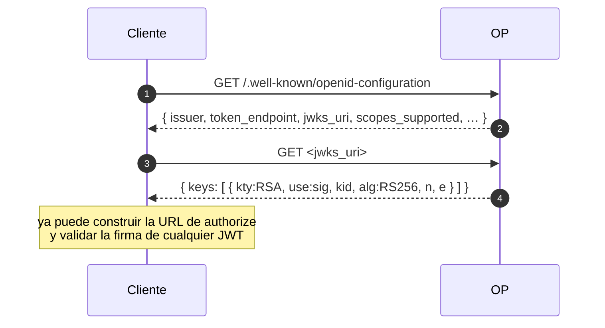
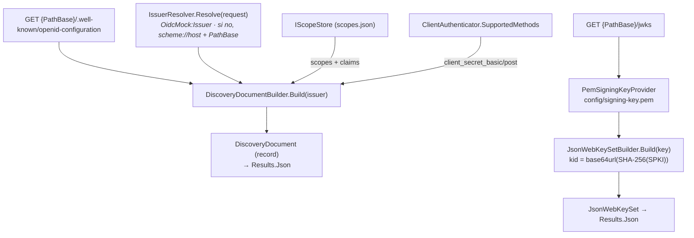
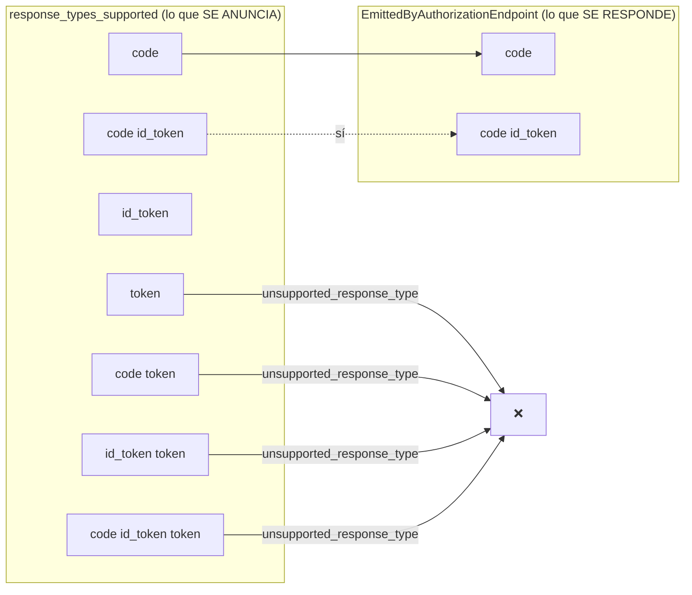

# 02 · Discovery y JWKS

Antes de mandar a nadie a una pantalla de login, un cliente necesita saber **dónde** están los
endpoints y **con qué clave** validar la firma. De eso se encargan dos documentos públicos.

## 🟦 Teoría

OpenID Connect Discovery (parte de OpenID Connect Core) define dos recursos bien conocidos:

- **`GET /.well-known/openid-configuration`** → el *discovery document*: un JSON con el `issuer` y las
  URLs de cada endpoint, más listas de capacidades (`grant_types_supported`,
  `response_types_supported`, `scopes_supported`, …).
- **`GET <jwks_uri>`** → el **JWKS** (*JSON Web Key Set*): las claves públicas con las que verificar
  los JWT que firma el OP.

Reglas que manda la teoría:

1. **El `issuer` se compara literalmente** con el claim `iss` de los tokens. Si no coinciden, el token
   se rechaza.
2. **Todas las URLs cuelgan del `issuer`.** Menos el `jwks_uri`, que es libre.
3. **El cliente valida la firma** descargando el JWKS y usando la clave cuyo `kid` coincide con la
   cabecera del JWT; si no hay `kid`, prueba las candidatas.
4. **`kid` = identidad de la clave.** Permite rotar sin romper tokens vivos mientras dure su `exp`.

## 🟩 Servidor real

El discovery del BCCR (pegado en [`AGENTS.md`](../../AGENTS.md)) tiene detalles que **no** son
universales y que el mock debe imitar:

- `issuer` **con barra final**: `https://oauth2.bccr.fi.cr/personafisica/`.
- `jwks_uri` **anidado** bajo el well-known: `…/personafisica/.well-known/openid-configuration/jwks`
  (muchos OP usan `/connect/jwks` o `/jwks.json`; este no).
- Prefijo de rutas `/personafisica/` en **todos** los endpoints (`/connect/authorize`,
  `/connect/token`, …).
- Un catálogo gigante de `scopes_supported` (≈70) y `claims_supported` (≈40), incluidos los del BCCR
  (`documentofva`, `Bccr.IdEntidad`, `custom.profile`, `SAML2P:TeamMateSugeval`, …).
- `id_token_signing_alg_values_supported: ["RS256"]` y `subject_types_supported: ["public"]`.

## 🟨 OidcMock

El mock se dejó **construir por petición** (el issuer puede deducirse del host) y publica **solo lo
que implementa** — pero el mismo *nombre* de campo y la misma forma que el real.

Piezas clave:

| Pieza | Archivo | Qué hace |
| --- | --- | --- |
| Builder del discovery | [`Discovery/DiscoveryDocumentBuilder.cs`](../../src/OidcMock.Core/Discovery/DiscoveryDocumentBuilder.cs) | Arma el JSON; los `scopes`/`claims` salen del store, el resto de constantes del dominio |
| Normalización de URLs | [`Discovery/EndpointUri.cs`](../../src/OidcMock.Core/Discovery/EndpointUri.cs) | `issuer` con barra; compone `issuer + ruta` sin concatenar a mano |
| Rutas (`connect/authorize`, …) | [`Discovery/EndpointPaths.cs`](../../src/OidcMock.Core/Discovery/EndpointPaths.cs) | Los mismos *paths* que el real |
| Capacidades fijas | [`Discovery/DiscoveryCapabilities.cs`](../../src/OidcMock.Core/Discovery/DiscoveryCapabilities.cs) | `RS256`, `subject_types=public`, `backchannel=poll` |
| JWKS | [`Discovery/JsonWebKeySetBuilder.cs`](../../src/OidcMock.Core/Discovery/JsonWebKeySetBuilder.cs) | Publica `kty/use/kid/alg/n/e` desde la RSA |
| `kid` estable | [`Crypto/SigningKeyId.cs`](../../src/OidcMock.Core/Crypto/SigningKeyId.cs) | `base64url(SHA-256(SubjectPublicKeyInfo))` |
| Clave de firma | [`Host/Crypto/PemSigningKeyProvider.cs`](../../src/OidcMock.Host/Crypto/PemSigningKeyProvider.cs) | Carga `config/signing-key.pem`; **la genera** si no existe |
| Endpoints | [`Host/Endpoints/DiscoveryEndpoints.cs`](../../src/OidcMock.Host/Endpoints/DiscoveryEndpoints.cs) | Registra discovery y JWKS |

### El punto que más se olvida: *anunciar es una promesa*

El mock separa a propósito **dos listas** para `response_type`, porque en el servidor real no son la
misma cosa:

Se anuncia todo por **paridad** (una app que valide la metadata no debe fallar al arrancar), pero solo
se *responde* el código y el híbrido. Es la decisión **D-042** de
[`docs/decisions.md`](../decisions.md). El test de forma además fija que las claves que anuncia el mock
sean **subconjunto** de las del JSON de referencia del BCCR.

Siguiente: **[03 · Authorization Code + PKCE](03-authorization-code-y-pkce.md)**.
