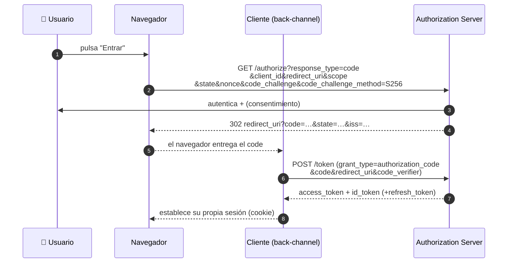
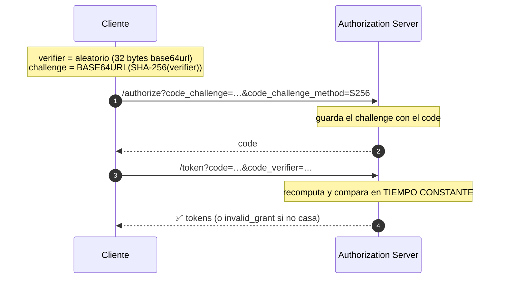
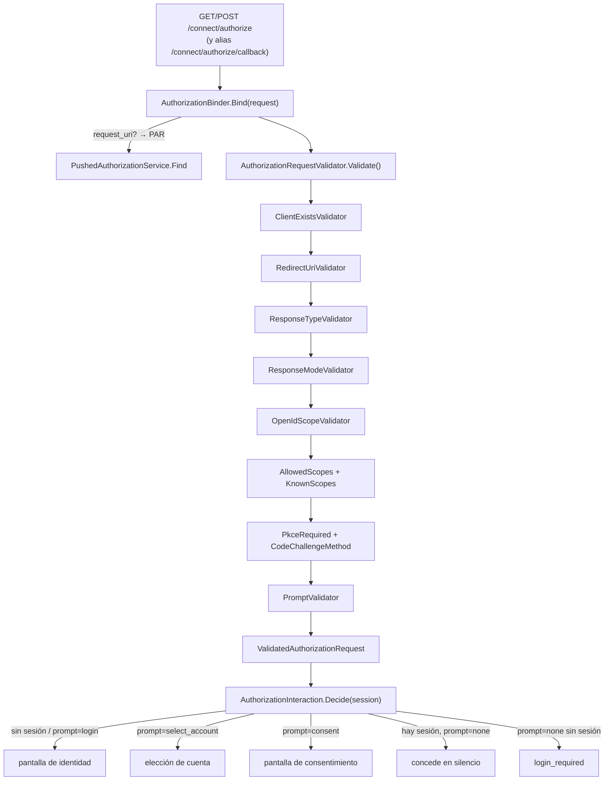

# 03 · Authorization Code Flow + PKCE

Es **el flujo**. Todo lo demás (refresh, userinfo, logout) cuelga de él. Y es el que usa el BCCR.

## 🟦 Teoría

RFC 6749 § 4.1 y OpenID Connect Core § 3. El cliente **no ve nunca la contraseña**: el usuario se
autentica en el OP y este devuelve al cliente un **código** de un solo uso que, canjeado en un canal
de back-channel (servidor a servidor), se convierte en tokens.

Parámetros que importan:

| Parámetro | Para qué | Si falta/estorba |
| --- | --- | --- |
| `response_type=code` | Pide un código, no tokens en la URL | otro valor → `unsupported_response_type` |
| `client_id` | Identifica al cliente | desconocido → error **sin** redirigir |
| `redirect_uri` | A dónde volver | no registrado → error **sin** redirigir |
| `scope` | Qué claims/permisos | `openid` es obligatorio en OIDC |
| `state` | Anti-CSRF: el cliente lo genera y lo **verifica** al volver | se devuelve tal cual |
| `nonce` | Anti-replay del `id_token`: el cliente lo verifica dentro del JWT | se devuelve dentro del `id_token` |
| `code_challenge` (+`method`) | **PKCE** | obligatorio si el cliente lo exige |

### PKCE, en una imagen

Refuerzo específico para clientes públicos (SPA, móvil): si un atacante roba el `code`, no puede
canjearlo sin el `code_verifier`, que **nunca** viajó por el front-channel.

Dos métodos (RFC 7636 § 4.2): `plain` (challenge = verifier, solo para cuando no hay alternativa) y
`S256` (challenge = hash SHA-256). **`S256` es el recomendado.**

## 🟩 Servidor real

El OP real (estilo IdentityServer) hace exactamente esto y además:

- Valida **cada** parámetro contra la configuración del cliente y responde `invalid_request` /
  `unauthorized_client` cuando algo no encaja.
- Solo emite `id_token` cuando el `scope` incluye `openid`.
- Devuelve el `iss` en la respuesta de autorización (`authorization_response_iss_parameter_supported:
  true` en el discovery del BCCR).
- Exige `code_challenge` a los clientes con PKCE obligatorio.
- Rechaza `response_mode=query` cuando la respuesta llevaría tokens (los tokens van en el **fragmento**,
  a salvo del historial y las cabeceras `Referer` — *OAuth 2.0 Multiple Response Type Encoding*).

## 🟨 OidcMock

El authorize del mock es una **cadena de validadores** + una **decisión de interacción**. El GET valida
y decide pantalla; el POST procesa esa pantalla.

Detalles que valen la pena:

- **Errores que se pueden redirigir vs. no.** Solo `client_id` y `redirect_uri` (y `request_uri`) se
  comprueban **antes** de conocer una URL verificada; sus errores se muestran en el endpoint, no se
  redirigen, para no crear un **open redirect**. El resto de errores viajan por el `redirect_uri`.
  Cada validador lo declara con `ErrorIsRedirectable`.
- **PKCE por defecto = `plain`.** Si llega `code_challenge` sin `code_challenge_method`, se asume
  `plain`, como manda RFC 7636 § 4.3.
- **`prompt=none` (silent)**: con sesión concede sin mostrar nada; sin sesión, `login_required`.
- **El código se emite** en `AuthorizationService.Approve` con el cliente, el usuario, los scopes, el
  `nonce`, el `state`, el challenge PKCE y la **sesión** — todo lo que el canje necesitará después.

| Pieza | Archivo |
| --- | --- |
| Endpoint GET/POST | [`Host/Endpoints/AuthorizationEndpoints.cs`](../../src/OidcMock.Host/Endpoints/AuthorizationEndpoints.cs) |
| Orquestación por petición | [`Host/Endpoints/AuthorizationFlow.cs`](../../src/OidcMock.Host/Endpoints/AuthorizationFlow.cs) |
| Enlace + resolución de `request_uri` | [`Host/Endpoints/AuthorizationBinder.cs`](../../src/OidcMock.Host/Endpoints/AuthorizationBinder.cs) |
| Cadena de reglas | [`Core/Authorization/AuthorizeRequestValidators.cs`](../../src/OidcMock.Core/Authorization/AuthorizeRequestValidators.cs) + `Validators/` |
| Decisión pantalla/silencio | [`Core/Authorization/AuthorizationInteraction.cs`](../../src/OidcMock.Core/Authorization/AuthorizationInteraction.cs) |
| PKCE | [`Core/Codes/CodeChallenges.cs`](../../src/OidcMock.Core/Codes/CodeChallenges.cs), [`CodeVerifier.cs`](../../src/OidcMock.Core/Codes/CodeVerifier.cs) |
| Respuesta (query/fragment/form_post) | [`Host/Endpoints/AuthorizationResponder.cs`](../../src/OidcMock.Host/Endpoints/AuthorizationResponder.cs) |

> **Sin JavaScript por diseño.** Las pantallas de identidad y consentimiento son HTML+POST sencillos;
> la única excepción es el micro-JS de "Copiar" en la pantalla raíz. El login **no verifica
> contraseñas** salvo en el grant `password`: la pantalla de identidad deja el `sub` y los `claim.*`
> **editables** a propósito, para poder probar identidades sin datos reales.

Siguiente: **[04 · id_token y claims](04-id-token-y-claims.md)**.
