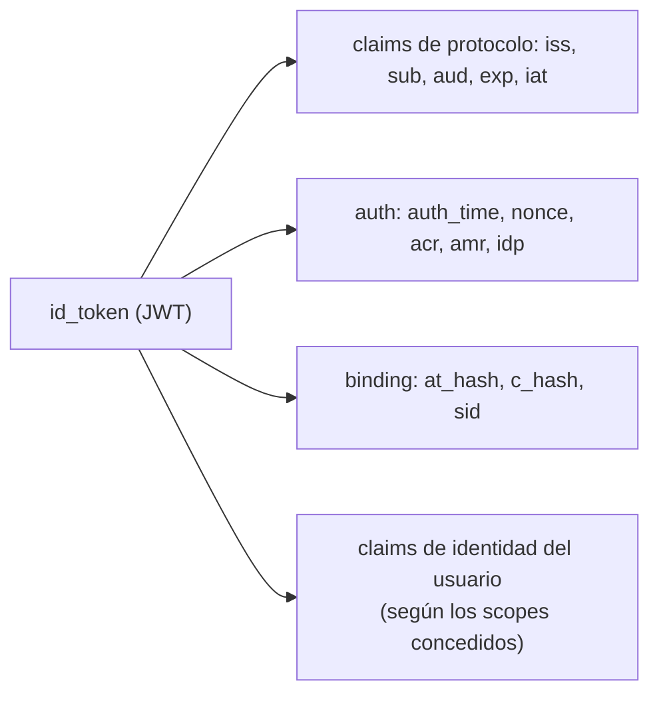
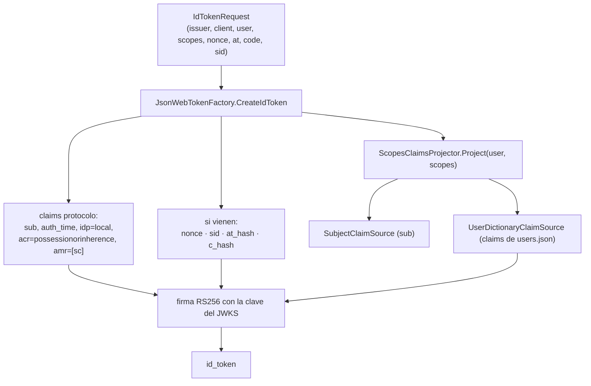

# 04 · id_token y claims

El `id_token` es lo que convierte un flujo OAuth en un flujo **OpenID**: no es una credencial para la
API, es una **afirmación firmada de identidad** con audiencia = el cliente.

## 🟦 Teoría

OpenID Connect Core § 2 y § 3.1.3.6. Un `id_token` es un JWT con estos claims obligatorios en el flujo
de autorización:

| Claim | Significa |
| --- | --- |
| `iss` | Quién lo emitió (debe coincidir **literalmente** con el `issuer` del discovery) |
| `sub` | El identificador **estable** del usuario en ese emisor |
| `aud` | El `client_id` para el que se emitió |
| `exp` | Caducidad |
| `iat` | Emitido en |
| `auth_time` | **Cuándo** se autenticó el usuario (si se pidió `max_age` o hay `auth_time` en la petición) |
| `nonce` | Eco del `nonce` de la petición (anti-replay) |

Y los claims **de binding** que atan el id_token a la respuesta en que viajó:

- **`at_hash`** = mitad izquierda del hash del `access_token`, con el algoritmo de firma (`RS256` →
  SHA-256), en base64url. Prueba que el `access_token` vino del mismo mensaje.
- **`c_hash`** = lo mismo para el `authorization_code`. Solo aparece en el **flujo híbrido**.
- **`sid`** = identificador de sesión; conecta el `id_token` con la sesión del OP (para logout).



### Claims del usuario: la proyección por `scope`

Un `id_token` **no** lleva todos los datos del usuario: lleva los claims que el **`scope` concedido**
autoriza. La tabla "scope → claims" es la que decide qué se expone.

| scope | claims típicos |
| --- | --- |
| `openid` | `sub` |
| `profile` | `name`, `given_name`, `family_name`, `preferred_username`, `locale`, `picture`, … |
| `email` | `email`, `email_verified` |
| `address` | `address` |
| `phone` | `phone_number`, `phone_number_verified` |

Claim pedido y no declarado → se **omite** (no se inventa).

## 🟩 Servidor real

El OP real añade y varía:

- Emite `acr` (contexto de autenticación) y `amr` (métodos, p. ej. `["pwd"]` o `["sc"]` de tarjeta) e
  `idp` (proveedor usado). En el BCCR, la captura de GAUDI muestra `amr:["sc"]`,
  `acr:"possessionorinherence"`, `idp:"local"`.
- `sid` en el id_token = la **sesión del navegador** que hizo login.
- Firma siempre `RS256`; podría rotar claves (`kid`) sin cortar tokens vivos.
- Con **refresh**, reemite un `id_token` nuevo (OpenID Connect Core § 12.2) cuando se conserva `openid`.

## 🟨 OidcMock

El id_token lo construye [`Tokens/JsonWebTokenFactory.cs`](../../src/OidcMock.Core/Tokens/JsonWebTokenFactory.cs).
Los hashes se calculan en [`Tokens/TokenHash.cs`](../../src/OidcMock.Core/Tokens/TokenHash.cs) y la
proyección de claims de usuario en
[`Claims/ScopesClaimsProjector.cs`](../../src/OidcMock.Core/Claims/ScopesClaimsProjector.cs).



Valores que el mock **fija** para parecerse al real (no autentica de otra forma):

```jsonc
{
  "iss": "https://localhost:5443/personafisica/",   // emisor anunciado (con barra)
  "sub": "user-persona-fisica",
  "aud": "web-app-spa",                              // client_id
  "auth_time": 1735689600,
  "nonce": "nonce-de-prueba",                        // si se pidió
  "at_hash": "…", "c_hash": "…",                     // según el flujo
  "sid": "AB12…",                                    // sesión del navegador
  "idp": "local", "acr": "possessionorinherence", "amr": ["sc"],
  "email": "jperez@example.cr", "name": "Juan Pérez" // proyectados por scope
}
```

- **`iss` con barra final**, igual que el real (de `EndpointUri.NormalizeIssuer`).
- **`id_token` solo con scope `openid`.** La regla vive en
  [`Grants/IdTokenRules.cs`](../../src/OidcMock.Core/Grants/IdTokenRules.cs) y la comparten **todos** los
  grants: canjear sin `openid` es OAuth a secas y no devuelve identidad.
- **`nbf` = `iat`**, `exp` = `iat + TokenLifetimes.IdentityToken`, y todo el reloj sale del
  `TimeProvider` inyectado (tokens deterministas en los tests).
- **`at_hash`/`c_hash`**: se calculan con la **mitad izquierda** del SHA-256, como manda OIDC. No
  confundir con el hash completo de PKCE.

> Nota fina: en el flujo **híbrido** el `id_token` viaja en el **fragmento** con `c_hash`; en el flujo
> de **código** viaja en la **respuesta del token endpoint** con `at_hash`. Ver
> [09 · Flujo híbrido](09-flujo-hibrido.md).

Siguiente: **[05 · Token endpoint y grants](05-token-endpoint-y-grants.md)**.
