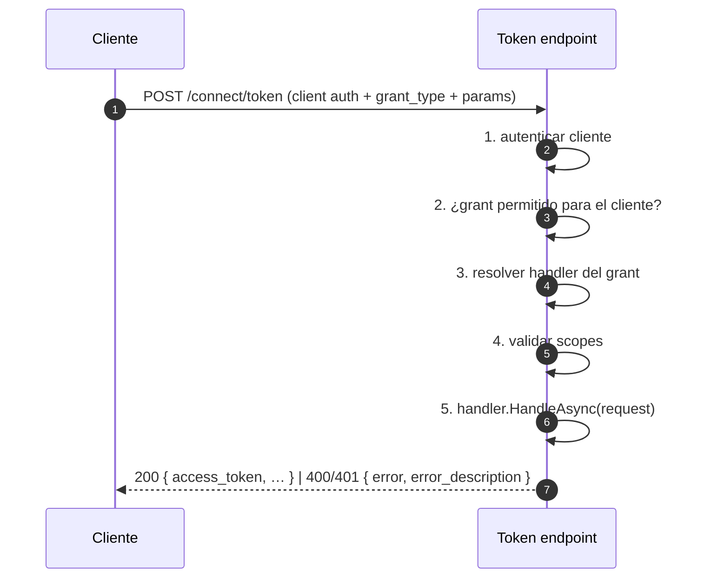
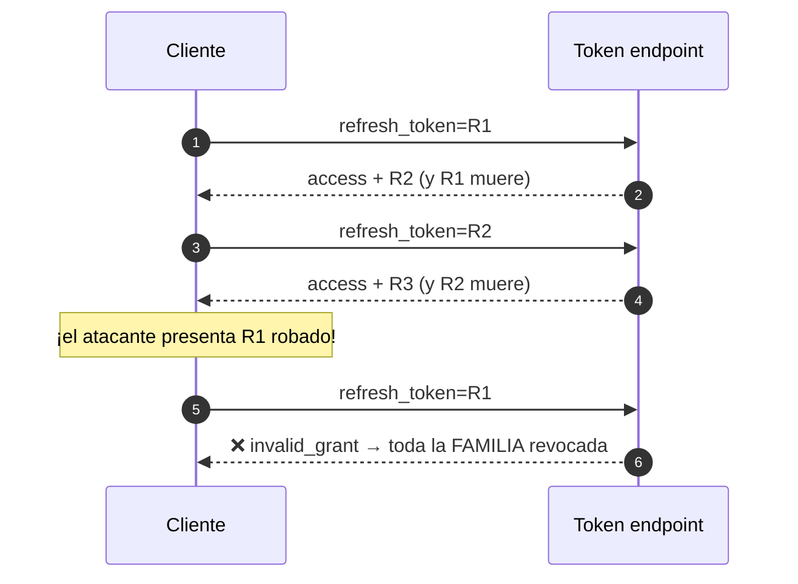
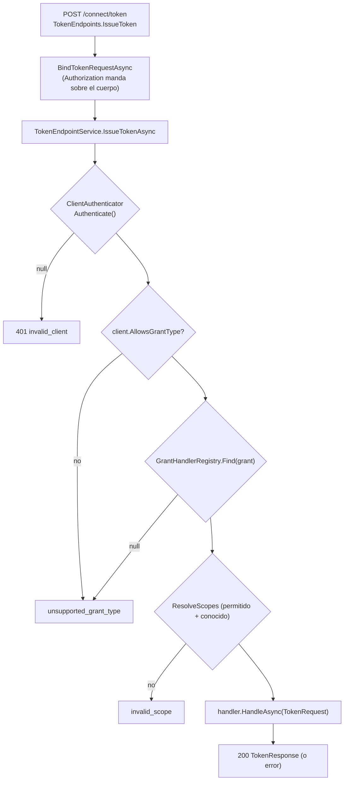
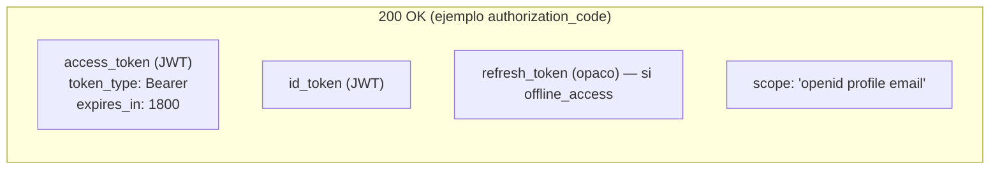

# 05 · Token endpoint y grants

`POST /connect/token` es la puerta donde un `grant_type` distinto elige **cómo** se obtienen los tokens.
En el mock esto es un **registro de estrategias** (patrón Strategy).

## 🟦 Teoría

RFC 6749 § 4 y § 5. El token endpoint siempre es `POST`, siempre
`application/x-www-form-urlencoded`, y autentica al cliente (si es confidencial). Devuelve JSON con
`access_token`, `token_type` (`Bearer`), `expires_in` y, según el caso, `refresh_token`, `id_token` y
`scope`.

| `grant_type` | Autorización para | Devuelve |
| --- | --- | --- |
| `authorization_code` | canjear el `code` de un login | access + id (+ refresh con `offline_access`) |
| `refresh_token` | renovar sin usuario | access (+ id si conserva `openid`), **refresh nuevo** |
| `client_credentials` | el cliente es el sujeto | solo access (no hay usuario) |
| `password` | usuario+contraseña directos (obsoleto) | access + id (+ refresh) |
| `urn:…:device_code` | dispositivo sin navegador | access (+ id) |
| `urn:openid:…:ciba` | back-channel iniciado por el cliente | access (+ id) |

Errores de este endpoint (RFC 6749 § 5.2): `invalid_request`, `invalid_client` (**401**),
`invalid_grant`, `unauthorized_client`, `unsupported_grant_type`, `invalid_scope`.

### Rotación de refresh token

OAuth 2.1 empuja la **rotación obligatoria**: cada canje emite un refresh **nuevo** y el usado queda
inutilizable. Si un refresh **ya canjeado** vuelve a aparecer, eso delata que la cadena se copió, así
que se **revoca toda la familia**.

## 🟩 Servidor real

El OP real autentica al cliente por `client_secret_basic` (encabezado `Authorization`) o
`client_secret_post` (cuerpo), da prioridad al encabezado (RFC 6749 § 2.3.1), y exige `offline_access`
para emitir refresh. Devuelve `WWW-Authenticate` en los 401. El BCCR además soporta auth por
**certificado de cliente** (`ClientCertificate`) que el mock no implementa.

## 🟨 OidcMock

El despacho vive en [`Grants/TokenEndpointService.cs`](../../src/OidcMock.Core/Grants/TokenEndpointService.cs)
y cada grant es una clase en `Core/Grants/`, registrada en DI
([`Host/ServiceCollectionExtensions.cs`](../../src/OidcMock.Host/ServiceCollectionExtensions.cs)).

Handlers registrados y su particularidad:

| Grant | Archivo | Qué hace especial |
| --- | --- | --- |
| `authorization_code` | `AuthorizationCodeGrantHandler.cs` | redime el code, verifica `redirect_uri` y `code_verifier` (PKCE) |
| `refresh_token` | `RefreshTokenGrantHandler.cs` | rota; no puede **ampliar** scope; detecta reutilización y revoca la familia |
| `client_credentials` | `ClientCredentialsGrantHandler.cs` | solo clientes **confidenciales**; `sub` = `client_id`; sin id_token/refresh |
| `password` | `PasswordGrantHandler.cs` | compara en tiempo constante; obsoleto pero soportado por paridad |
| `device_code` / `ciba` | `PollGrantHandler.cs` | ciclo de sondeo (ver [10](10-par-device-ciba.md)) |

### Un detalle del mock: las factorías de `TokenRequest`

`TokenRequest` tiene **11 parámetros**, nueve de ellos `string?` seguidos. Transponer `userName` y
`password` compila sin aviso y rompe en ejecución. Por eso hay **factorías con nombre**
(`ForAuthorizationCode`, `ForRefreshToken`, …) y un único punto posicional en `TokenEndpointService`,
cubierto por `TokenRequestMappingTests`. Es la decisión **D-044**.

Siguiente: **[06 · UserInfo](06-userinfo.md)**.
