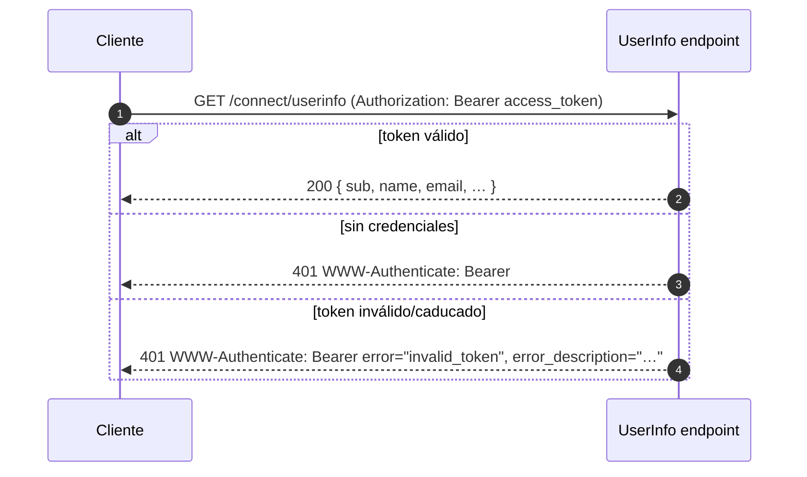
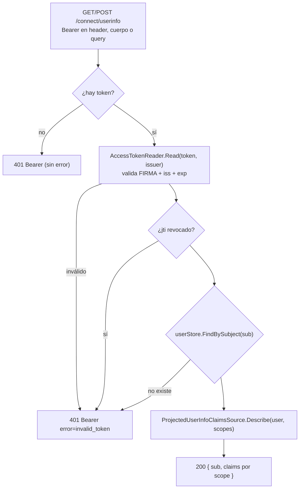

# 06 · UserInfo

`GET /connect/userinfo` devuelve los claims del usuario a partir de un `access_token`. Sirve para que
el cliente no tenga que meter todos los claims de perfil dentro del `id_token`.

## 🟦 Teoría

OpenID Connect Core § 5.1. El userinfo es un **recurso protegido OAuth**: se llama con
`Authorization: Bearer <access_token>` y responde un JSON con el `sub` **obligatorio** y, además, los
claims que autorizan los scopes del token.

Reglas (RFC 6750): el cliente puede mandar el token en el **encabezado** (§2.1) —lo preferido— o, si no
puede poner cabeceras, en el **cuerpo** (§2.2) o la **query** (§2.3); el encabezado manda si vino. Un
recurso protegido que responde 401 lleva el **reto Bearer**:

- **sin credenciales** → `WWW-Authenticate: Bearer` (sin código: no puedes decir que un token es
  inválido si no se presentó ninguno);
- **token inválido** → `WWW-Authenticate: Bearer error="invalid_token", error_description="…"`.

**Consistencia:** los claims del userinfo deben **coincidir** con los del `id_token` para los mismos
scopes. Si no, el cliente ve dos verdades distintas sobre la misma persona.

## 🟩 Servidor real

El OP real aplica exactamente esas reglas y añade firma opcional de la respuesta
(`userinfo_signing_alg_values_supported: ["RS256"]` en el BCCR) y rechazos finos (`insufficient_scope`
→ 403 cuando el token no cubre el recurso). También, si el access_token es un JWT, puede leer los claims
directamente del token en vez de consultar un store.

## 🟨 OidcMock

Caso de uso en [`UserInfo/UserInfoService.cs`](../../src/OidcMock.Core/UserInfo/UserInfoService.cs);
endpoint en [`Host/Endpoints/TokenEndpoints.cs`](../../src/OidcMock.Host/Endpoints/TokenEndpoints.cs);
el reto en [`Errors/BearerChallenge.cs`](../../src/OidcMock.Core/Errors/BearerChallenge.cs).

Puntos concretos:

- **La misma proyección que el `id_token`.** El userinfo usa
  [`Claims/ScopesClaimsProjector.cs`](../../src/OidcMock.Core/Claims/ScopesClaimsProjector.cs), así que
  un cliente ve **exactamente** los mismos claims en ambos sitios.
- **Respeta la revocación.** Si el `jti` del access token fue revocado, responde 401 (ver
  [07](07-introspection-y-revocation.md)).
- **Audiencia no forzada.** El endpoint no conoce a priori el `client_id` del token, así que valida
  firma + `iss` + vigencia (deja `ValidateAudience` en off) — lo importante para autorizar la llamada.

| Método | Ruta | Auth |
| --- | --- | --- |
| `GET` / `POST` | `<base>/connect/userinfo` | `Bearer` access_token |

Siguiente: **[07 · Introspection y revocation](07-introspection-y-revocation.md)**.
