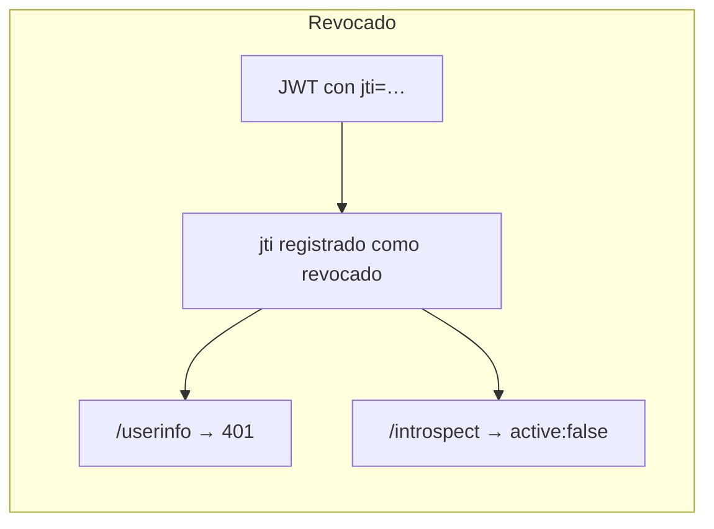
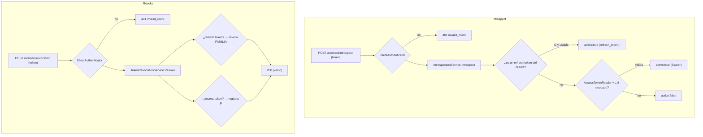

# 07 · Introspection y revocation

Dos endpoints de **gestión de tokens** que no emiten nada, solo consultan o cortan su vida.

## 🟦 Teoría

### Introspection (RFC 7662)

`POST /connect/introspect` responde si un token está **activo** y qué contiene. **Requiere cliente
autenticado** (si no, cualquiera podría espiar tokens ajenos). La respuesta clave es `active`:

```jsonc
// activo
{ "active": true, "client_id": "web-app-spa", "sub": "…", "scope": "openid profile",
  "token_type": "Bearer", "exp": 1735691400, "iat": 1735689600 }

// inactivo, caducado, revocado o de otro cliente
{ "active": false }
```

Regla sutil (RFC 7662 § 2.2): un token que no existe o no es tuyo se responde `active: false`, **no**
un error, para no revelar si existió.

### Revocation (RFC 7009)

`POST /connect/revocation` con `token=` **corta** la vida de un token. Como un access token es un JWT
**sin estado**, no hay nada que borrar dentro de él: se registra su identificador (`jti`) como revocado
y a partir de ahí deja de servir aunque su `exp` no haya llegado.

Ruptura con "no hay estado": un JWT es válido por firma hasta su `exp`, así que **normalmente** no se
puede invalidar antes de tiempo. La solución habitual es mantener un store de revocaciones (o acortar
la vida del token).



## 🟩 Servidor real

El real exige autenticación de cliente en ambos endpoints (`revocation_endpoint_auth_methods_supported`
e `introspection_endpoint_auth_methods_supported`), devuelve `active` con metadatos para tokens válidos,
y responde **200** a la revocación aunque el token no existiera (RFC 7009 § 2.2). El BCCR anuncia además
firma de la respuesta de introspection (`introspection_signing_alg_values_supported: ["RS256"]`).

## 🟨 OidcMock

Servicios en [`Introspection/IntrospectionService.cs`](../../src/OidcMock.Core/Introspection/IntrospectionService.cs)
y [`Revocation/TokenRevocationService.cs`](../../src/OidcMock.Core/Revocation/TokenRevocationService.cs);
el store compartido en [`Revocation/InMemoryTokenRevocationStore.cs`](../../src/OidcMock.Core/Revocation/InMemoryTokenRevocationStore.cs).



Detalles que distinguen al mock:

- **Un solo store** (`ITokenRevocationStore`) indexado por `jti` (access) y `family_id` (refresh); cada
  entrada se descarta al pasar su `exp`, porque a partir de ahí revocar es indistinguible de caducar.
- **Revocar un refresh corta la familia entera.** La rotación crea tokens de la misma familia; revocar
  solo el presentado dejaría vivo al siguiente. Se busca entre vivos **y** entre ya canjeados
  (`FindIssued`), porque el cliente normal canjea y **después** revoca el anterior.
- **Segunda puerta en el grant `refresh_token`:** aunque el store de refresh no lo encuentre, una
  familia revocada no se renueva. El store de revocaciones manda.
- **La ausencia de credenciales es `invalid_client` 401**, no un `active:false` ni un 200 — es una
  corrección real (D-039 y *"introspect y revocation autentican al cliente"* en `decisions.md`).

| Método | Ruta | Auth | Respuesta |
| --- | --- | --- | --- |
| `POST` | `<base>/connect/introspect` | cliente | JSON con `active` |
| `POST` | `<base>/connect/revocation` | cliente | `200` vacío |

Siguiente: **[08 · Sesión y logout](08-sesion-y-logout.md)**.
