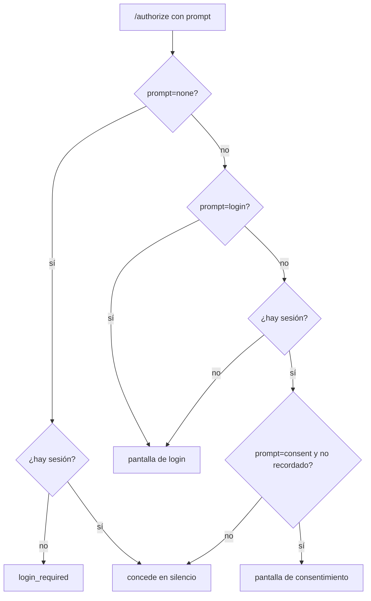
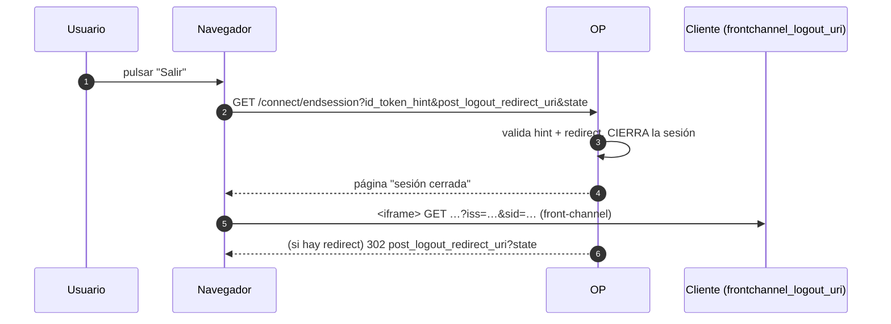
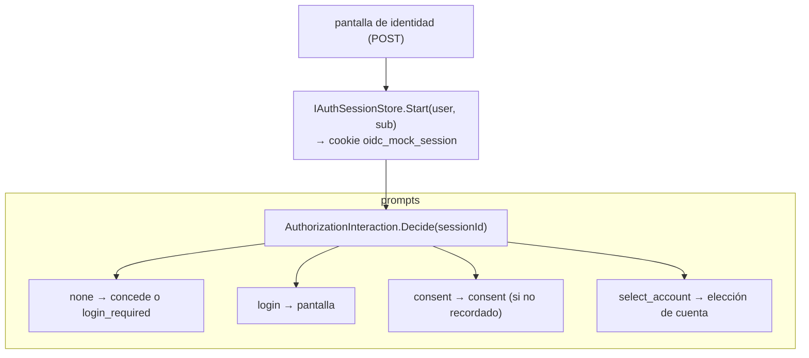
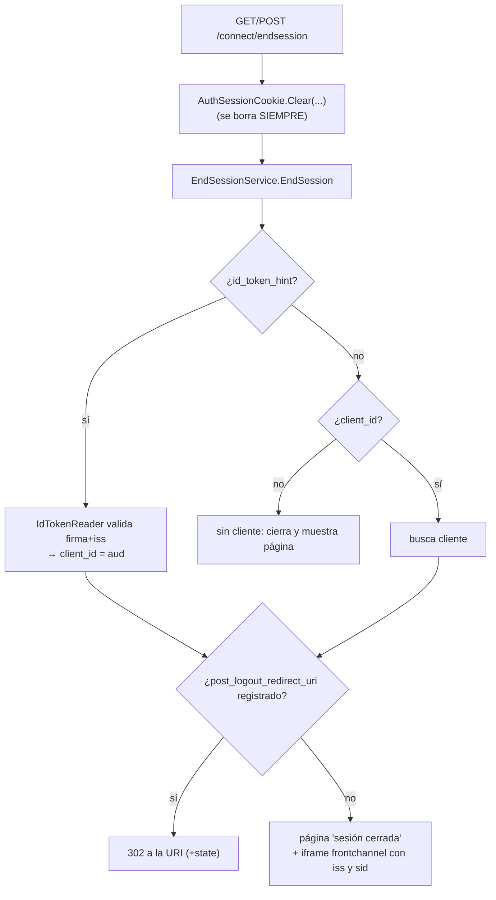

# 08 · Sesión y logout

Cómo el OP recuerda que ya te autenticaste (para no volver a pedir credenciales) y cómo cierra esa
sesión cuando el cliente lo pide.

## 🟦 Teoría

OIDC distingue **tres** cosas que a veces se llaman "sesión":

1. La **sesión del OP** (SSO): el usuario se autenticó una vez y el OP lo recuerda. Es lo que permite
   `prompt=none` y el login silencioso al volver a otra app.
2. La **sesión del cliente**: la cookie propia de la app.
3. El **`sid`**: un identificador que conecta el `id_token` con la sesión del OP, para poder cerrarla.

El **RP-Initiated Logout** (OpenID Connect RP-Initiated Logout 1) se dispara contra
`end_session_endpoint` con:

| Parámetro | Para qué |
| --- | --- |
| `id_token_hint` | Prueba de quién cierra; su `aud` identifica al cliente |
| `post_logout_redirect_uri` | A dónde volver tras cerrar (debe estar registrado) |
| `state` | Anti-CSRF de la vuelta |
| `client_id` | Alternativa al hint si no hay token |

Y el **`prompt`** (OpenID Connect Core § 3.1.2.1) controla la interacción:

| `prompt` | Comportamiento |
| --- | --- |
| *(ausente)* | reutiliza sesión si hay; si no, pide login |
| `none` | **prohibido** mostrar pantalla: o concede en silencio o falla |
| `login` | fuerza autenticación de nuevo |
| `consent` | fuerza consentimiento |
| `select_account` | pide elegir cuenta |

### Front-channel logout

OpenID Connect Front-Channel Logout 1: el OP avisa a cada cliente cargando, en la página de cierre, un
`<iframe src="frontchannel_logout_uri?iss=…&sid=…">`. El iframe **no es decorativo**: es la única señal
de que la sesión del cliente terminó.

## 🟩 Servidor real

El OP real mantiene sesión (SSO) y por eso `check_session_iframe` funciona de verdad: el cliente consulta
si la sesión sigue viva y, si no, refresca. Soporta front-channel **y** back-channel logout (el BCCR
anuncia ambos). Cierra la sesión solo si la petición es válida; si no, responde error.

## 🟨 OidcMock

El mock tiene sesión, pero **propia y opcional a propósito** ("sin sesiones persistentes").

- **La sesión es una cookie propia** `oidc_mock_session` ([`AuthSessionCookie.cs`](../../src/OidcMock.Host/Endpoints/AuthSessionCookie.cs)),
  no la de ASP.NET: es `HttpOnly`, `SameSite=Lax`, `Path` = base de la petición y vida configurable
  (`OidcMock:SessionLifetime`, por defecto 8 h). Escribir y borrar comparten la **misma** factoría de
  opciones porque el navegador empareja por (nombre, path) — un bug real que se corrigió (D-037).
- **`prompt=select_account`** muestra la pantalla de identidad como **elección de cuenta** (los perfiles
  de `users.json`), con o sin sesión, y precarga la de la sesión (D-043).
- **Consentimiento memorable** (D-045): `prompt=consent` no vuelve a preguntar lo ya aprobado para ese
  cliente+usuario; un scope ampliado sí vuelve a preguntar.

### `/connect/endsession`

- **El `id_token_hint` manda sobre el `client_id`** (va firmado): su `aud` es el cliente contra el que se
  valida el redirect. El orden importa: **primero** se valida la redirección, **después** se cierra —
  una petición inválida no debe tumbar la sesión de quien solo está probando una URL.
- **La cookie se borra siempre**, incluso si la petición es inválida.
- **La página de cierre** carga el `frontchannel_logout_uri` de cada cliente con `iss` y `sid` (ver
  [`EndSessionPage.cs`](../../src/OidcMock.Host/Endpoints/EndSessionPage.cs)). El `sid` del `id_token`
  (enhebrado desde el `AuthorizationCode`) es lo que llega ahí.

### `check_session_iframe` — **simulado**

El mock sirve una página en `<base>/connect/checksession` que hace `postMessage` al cargarse. **No**
implementa Session Management (OPiFrame): sirve para que un cliente que valida el discovery no falle,
no para probar la sincronización real de sesiones. Igual que Device y CIBA, se declara en el `README`.

Siguiente: **[09 · Flujo híbrido](09-flujo-hibrido.md)**.
