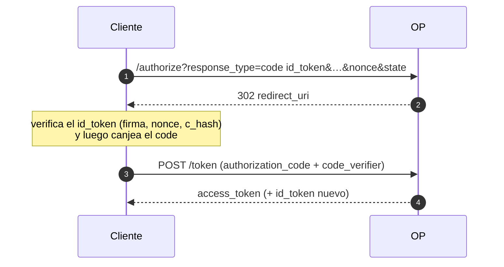
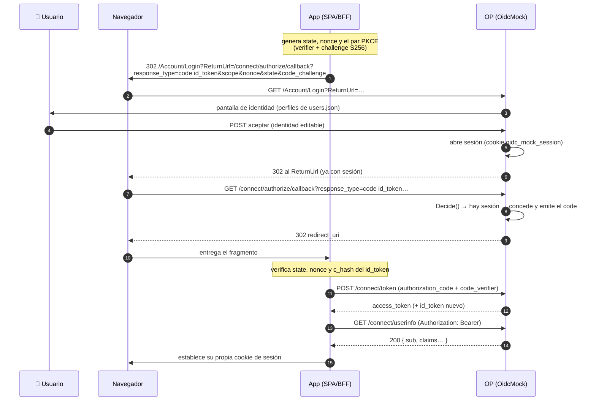
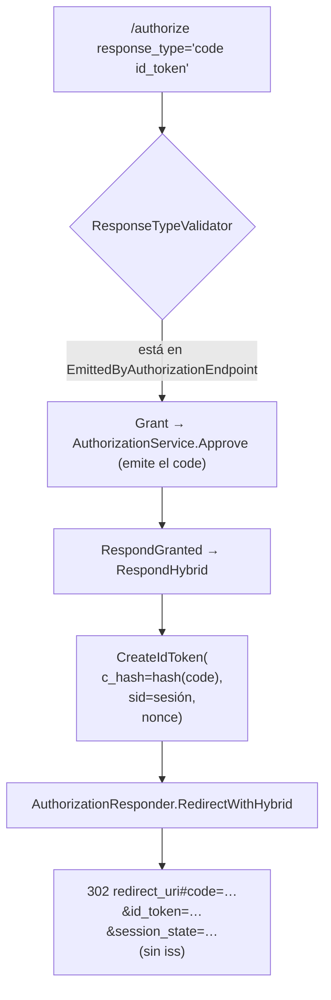

# 09 · Flujo híbrido (`code id_token`)

El flujo que pide **GAUDI**, el cliente real contra el que se calibró el mock. No es el clásico
`response_type=code`: devuelve el **código y el `id_token` juntos** en el fragmento del `redirect_uri`.

## 🟦 Teoría

*OAuth 2.0 Multiple Response Type Encoding Practices* + OpenID Connect Core § 3.3. El híbrido emite un
`id_token` **en el front-channel** (para que el cliente tenga identidad de inmediato) **y** un
`authorization_code` (para canjearlo después por un `access_token` en el back-channel). Como la
respuesta lleva un token, el `response_mode` por defecto es **`fragment`**, nunca `query`.

Claves del híbrido:

- **`c_hash`** dentro del `id_token`: ata el token al `code`. Como el code viaja en el mismo fragmento,
  el cliente puede verificar que ambos van juntos.
- **`state`** y **`session_state`** viajan en el fragmento.
- El `response_mode` **no** puede ser `query` en el híbrido (el `id_token` se filtraría en el historial
  y el `Referer`).

## El flujo híbrido, completo (de punta a punta)

Así se ve el híbrido con **login incluido**: el cliente no pide autorización a ciegas; primero lleva al
usuario a la pantalla del OP (`/Account/Login`) y el `ReturnUrl` apunta al authorize.

Qué **valida el cliente** en cada salto (y por qué no basta con lo que emite el OP):

| Salto | Se verifica | Contra |
| --- | --- | --- |
| Fragmento del authorize | `state` | el `state` que el cliente guardó |
| `id_token` del fragmento | firma (`kid` del JWKS), `iss`, `aud`, `exp` | el JWKS + la config del cliente |
| `id_token` del fragmento | `nonce` | el `nonce` que el cliente generó |
| `id_token` del fragmento | `c_hash` | el `code` que llegó en el mismo fragmento |
| Respuesta del token endpoint | `at_hash` del `id_token` | el `access_token` recibido |

## 🟩 Servidor real

El servidor real que imita el mock (el del BCCR, del que GAUDI es cliente) emite el híbrido con estos
**formatos observados** (no son opacos: se ven en la URL de retorno):

| Elemento | Formato observado |
| --- | --- |
| `code` | 64 hexadecimales en mayúscula con sufijo `-1` |
| `session_state` | `<43 base64url>.<32 HEX en mayúscula>` |
| `sid` (en el id_token) | 32 hexadecimales en mayúscula |
| `amr` / `acr` / `idp` | `["sc"]` / `"possessionorinherence"` / `"local"` |
| fragmento | `#code=…&id_token=…&session_state=…` — **sin** `?` y **sin** `iss` |

Nota fina: el servidor real **omite `iss`** en la respuesta híbrida aunque anuncia
`authorization_response_iss_parameter_supported: true`. El mock imita **lo que hace**, no lo que dice.

Y expone dos rutas de entrada que GAUDI usa:

- `/Account/Login?ReturnUrl=…` — la pantalla de login real (ASP.NET Identity), con `ReturnUrl` local.
- `/connect/authorize/callback` — alias del authorize y destino de ese `ReturnUrl`.

## 🟨 OidcMock

El híbrido se emite en [`Host/Endpoints/AuthorizationFlow.cs`](../../src/OidcMock.Host/Endpoints/AuthorizationFlow.cs)
(`RespondHybrid`) y se compone en
[`Host/Endpoints/AuthorizationResponder.cs`](../../src/OidcMock.Host/Endpoints/AuthorizationResponder.cs)
(`RedirectWithHybrid`).

Puntos que fija el mock:

- **`code id_token` está en `EmittedByAuthorizationEndpoint`** (se responde); las combinaciones con
  access token siguen rechazándose con `unsupported_response_type` (D-042).
- **El fragmento sale exactamente como la captura**: `#code=…&id_token=…&session_state=…`, **sin** el
  `?` que quedaba tras el `#` (bug de serialización corregido) y **sin** `iss`. El flujo de `code`
  puro **sí** conserva el `iss`.
- **`session_state`** con el formato observable: 43 base64url + `.` + 32 HEX mayúscula
  ([`Authorization/SessionStateValue.cs`](../../src/OidcMock.Core/Authorization/SessionStateValue.cs)).
- **Claims de sesión del `id_token`**: `sid` (la sesión enhebrada por el `AuthorizationCode` hasta el
  canje), `amr=["sc"]`, `acr="possessionorinherence"`, `idp="local"` — valores **fijos**, observados en
  la captura; el mock no autentica con tarjeta, solo imita la forma.
- **`response_mode` por defecto**: fragmento cuando la respuesta lleva tokens; `query` solo para `code`.
  `response_mode=query` con un híbrido → `invalid_request`.

### Rutas de entrada de GAUDI

| Ruta | Qué hace en el mock |
| --- | --- |
| `GET/POST /Account/Login?ReturnUrl=` | reproducida en [`Host/Endpoints/AccountLoginEndpoints.cs`](../../src/OidcMock.Host/Endpoints/AccountLoginEndpoints.cs); el `ReturnUrl` debe ser **local** (una URL absoluta → 400, por open redirect); Denegar simula fallo de autenticación |
| `GET/POST /connect/authorize/callback` | alias del authorize (mismo `ShowAuthorization`/`ProcessDecision`) |

La prueba end-to-end vive en `scripts/oidc-test.py`: construye la URL de entrada, desglosa el fragmento
de retorno y decodifica el JWT (contrastando el `sub`). Config de prueba: cliente público
`fb02079c-3143-49e6-a776-dd9b002388d2` (PKCE obligatorio, redirect falso) y usuario `prueba`
(`sub=01-2222-3333`, **dato falso**).

> Documentación relacionada: *"Adaptacion a GAUDI: flujo hibrido y rutas de entrada"* en
> [`docs/decisions.md`](../decisions.md), y la sección *"Probar el flujo de GAUDI"* de
> [`README.md`](../../README.md).

Siguiente: **[10 · PAR, Device y CIBA](10-par-device-ciba.md)**.
