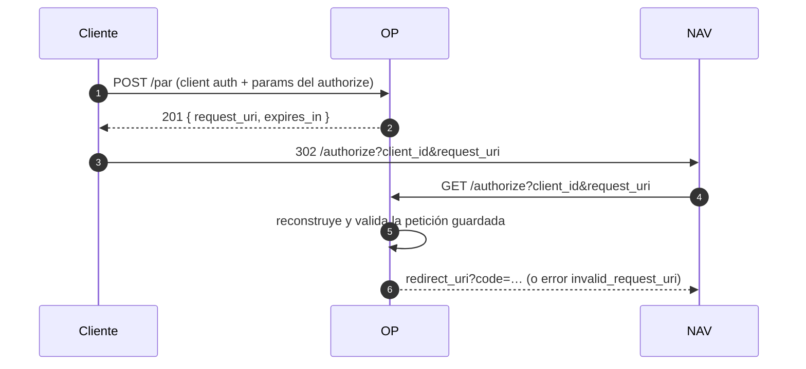
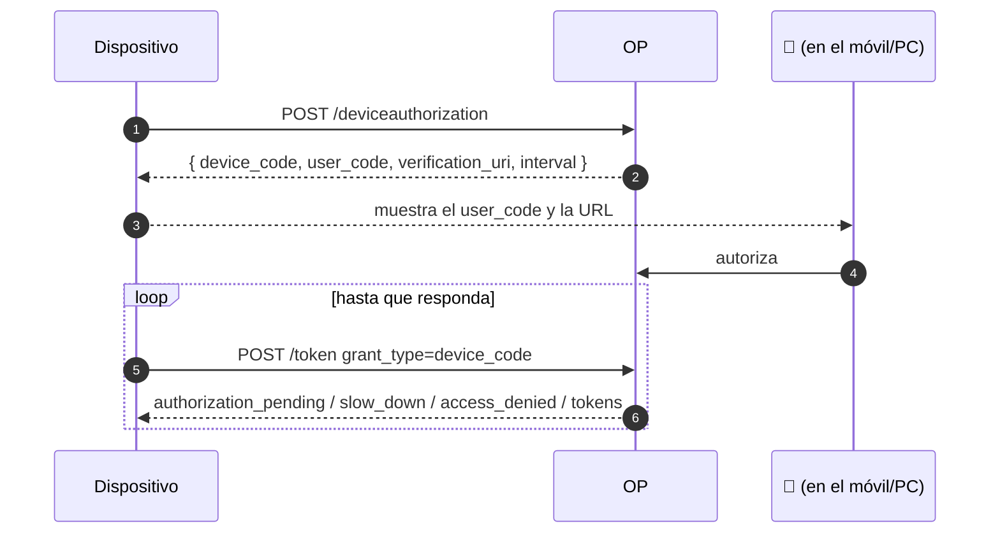
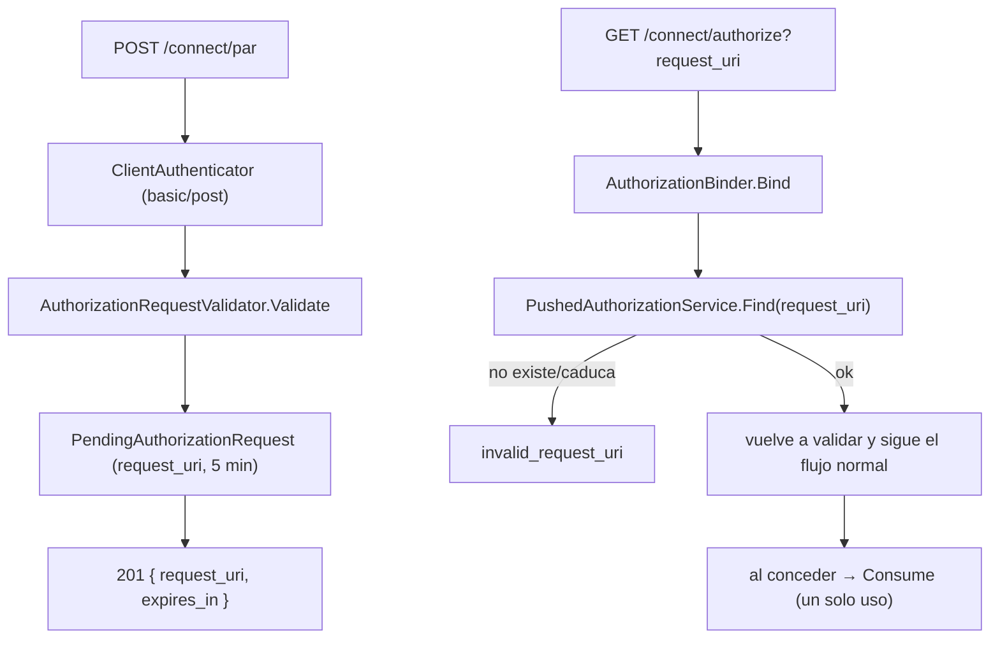
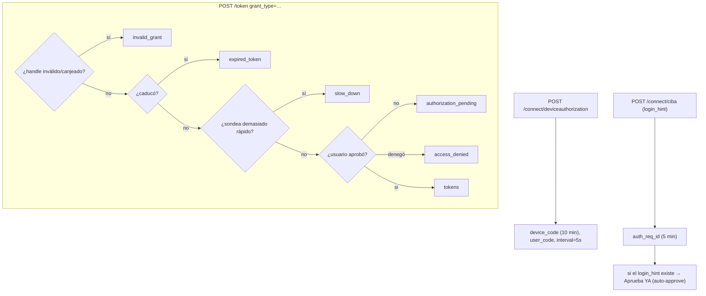

# 10 · PAR, Device y CIBA

Tres flujos que no siguen el patrón "authorize → redirect con code" y que el discovery del BCCR anuncia.
El mock los cubre a niveles distintos: PAR **resuelto**, Device y CIBA **simulados**.

## 🟦 Teoría

### PAR — Pushed Authorization Requests (RFC 9126)

En vez de mandar la petición de autorización por la barra de direcciones, el cliente la **empuja** por
back-channel a `/par` y recibe un `request_uri`; luego solo manda ese `request_uri` al authorize. Ventaja:
los parámetros sensibles no viajan en la URL, y el OP valida **antes** de tocar el navegador.

El `request_uri` es de **un solo uso** y caduca.

### Device Authorization Grant (RFC 8628)

Para dispositivos sin navegador (TV, CLI). El dispositivo pide un `device_code` (secreto) y un
`user_code` (legible); el usuario autoriza en **otro** dispositivo; el primero **sondea** el token
endpoint.

Estados de sondeo (RFC 8628 § 3.5): `authorization_pending`, `slow_down`, `access_denied`,
`expired_token`.

### CIBA — Client-Initiated Backchannel Authentication

Un canal de autenticación iniciado por el **backend** (p. ej. autenticación sin contraseña en un call
center). El cliente obtiene un `auth_req_id` y **sondea** con el mismo ciclo que Device.

## 🟩 Servidor real

El BCCR anuncia los tres endpoints (`/connect/par`, `/connect/deviceauthorization`, `/connect/ciba`),
`require_pushed_authorization_requests: false` (PAR es opcional), y
`backchannel_token_delivery_modes_supported: ["poll"]` (entrega por sondeo, no push).
`backchannel_user_code_parameter_supported: true`.

## 🟨 OidcMock

### PAR — resuelto de verdad

Vive en [`PushedRequests/PushedAuthorizationService.cs`](../../src/OidcMock.Core/PushedRequests/PushedAuthorizationService.cs).
Detalles: se autentica con el **mismo** `ClientAuthenticator`; un `request_uri` desconocido o caducado es
`invalid_request_uri` (no `invalid_request` genérico); la petición reconstruida se **vuelve a validar**
(el código sale de la validación de hoy, no de la del push) y se invalida al conceder.

### Device y CIBA — **simulados**

Servicio en [`DeviceAuthorization/DeviceAuthorizationService.cs`](../../src/OidcMock.Core/DeviceAuthorization/DeviceAuthorizationService.cs)
(`PollAuthorizationService`) y handler de sondeo en
[`Grants/PollGrantHandler.cs`](../../src/OidcMock.Core/Grants/PollGrantHandler.cs).

Qué **no** hace (declarado en [`README.md`](../../README.md)):

- Device: no hay **pantalla de identificación** donde meter el `user_code`. Emite el `device_code`, el
  `user_code` y el `verification_uri` (`urn:oidc-mock:device`), y responde el ciclo RFC 8628, pero
  **nadie autoriza** de verdad, así que el sondeo se queda en `authorization_pending` hasta caducar.
- CIBA: no hay confirmación ni entrega **push**. Si el `login_hint` identifica a alguien del store, la
  petición queda **aprobada de inmediato** (camino feliz para pruebas); si no, se queda pendiente.

> **Para qué sirven estos simulados.** Para que una app que valida el discovery al arrancar no falle y
> para ejercitar el **ciclo de sondeo**. **No** para validar seguridad ni el comportamiento real de esos
> flujos. Ver la tabla de alcance en [`README.md`](../../README.md).

| Endpoint | Estado en el mock |
| --- | --- |
| `POST /connect/par` | ✅ resuelto (RFC 9126) |
| `POST /connect/deviceauthorization` | 🟡 simulado |
| `POST /connect/ciba` | 🟡 simulado |
| `GET /connect/checksession` | 🟡 simulado (página vacía) |

Siguiente: **[11 · Matriz de paridad](11-matriz-de-paridad.md)**.
