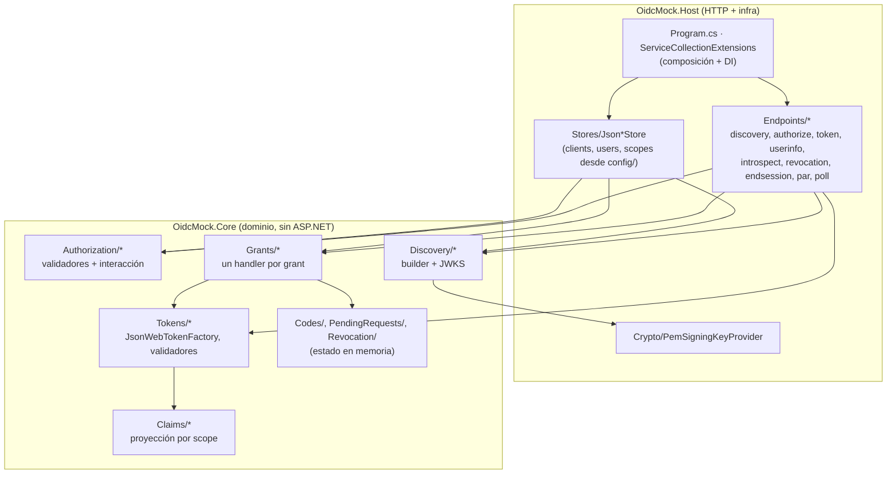

# 11 · Matriz de paridad (teoría · real · mock)

Resumen de todo lo anterior en tablas: **qué debería hacer** (teoría), **qué hace el servidor real** y
**qué hace OidcMock**, con el archivo que lo implementa y la decisión que lo fija.

Leyenda: ✅ implementado · 🟡 simulado/parcial · ⛔ no implementado (o anunciado sin implementar).

## Endpoints

| Endpoint (bajo `<base>`) | Teoría | Real (BCCR) | OidcMock | Código |
| --- | --- | --- | --- | --- |
| `GET /.well-known/openid-configuration` | Discovery | ✅ | ✅ | `DiscoveryEndpoints.cs` |
| `GET …/openid-configuration/jwks` | JWKS | ✅ (anidado) | ✅ | `JsonWebKeySetBuilder.cs` |
| `GET/POST /connect/authorize` | code + híbrido | ✅ | ✅ | `AuthorizationEndpoints.cs` |
| `/connect/authorize/callback` | — (alias real) | ✅ | ✅ | `AuthorizationEndpoints.cs` |
| `GET/POST /Account/Login` | — (login del OP) | ✅ | ✅ | `AccountLoginEndpoints.cs` |
| `POST /connect/token` | todos los grants | ✅ | ✅ | `TokenEndpoints.cs` / `TokenEndpointService.cs` |
| `GET/POST /connect/userinfo` | Bearer | ✅ | ✅ | `TokenEndpoints.cs` / `UserInfoService.cs` |
| `POST /connect/introspect` | RFC 7662 | ✅ | ✅ | `IntrospectionService.cs` |
| `POST /connect/revocation` | RFC 7009 | ✅ | ✅ | `TokenRevocationService.cs` |
| `GET/POST /connect/endsession` | RP-Initiated Logout | ✅ | ✅ | `EndSessionEndpoints.cs` |
| `POST /connect/par` | RFC 9126 | ✅ | ✅ | `PushedAuthorizationService.cs` |
| `POST /connect/deviceauthorization` | RFC 8628 | ✅ | 🟡 simulado | `PollAuthorizationService.cs` |
| `POST /connect/ciba` | CIBA 1.0 | ✅ | 🟡 simulado | `PollAuthorizationService.cs` |
| `GET /connect/checksession` | Session Mgmt | ✅ | 🟡 simulado | `CheckSessionPage.cs` |

## Tokens y vigencias

| Token | forma | teoría | mock (por defecto) | Notas |
| --- | --- | --- | --- | --- |
| `authorization_code` | opaco, un uso | corta vida | 5 min | `InMemoryCodeStore` |
| `access_token` | JWT RS256 | corta vida | 30 min | `aud` = `client_id`; lleva `scope` + `jti` |
| `id_token` | JWT RS256 | corta vida | 30 min | solo con scope `openid` |
| `refresh_token` | opaco, un uso, rota | vida larga | 8 h | solo con `offline_access` |

## Capacidades del discovery

| Campo | Real (BCCR) | Mock | ¿Por qué |
| --- | --- | --- | --- |
| `issuer` | con barra final | igual | comparación literal del `iss` |
| `id_token_signing_alg_values_supported` | `["RS256"]` | igual | clave RSA del JWKS |
| `subject_types_supported` | `["public"]` | igual | `sub` estable por usuario |
| `code_challenge_methods_supported` | `plain`, `S256` | igual | PKCE completo |
| `response_types_supported` | 7 combinaciones | las 7 (anunciadas) | paridad (ver D-042) |
| `grant_types_supported` | 7 | las 7 | incluye device y CIBA |
| `scopes_supported` / `claims_supported` | ≈70 / ≈40 | desde `scopes.json` | el store manda |
| `token_endpoint_auth_methods_supported` | basic, post, cert | basic, post | cert (mTLS) no implementado |

## Estado por característica

| Característica | Estado | Detalle |
| --- | --- | --- |
| `authorization_code` + PKCE (`plain`, `S256`) | ✅ | |
| Híbrido `code id_token` | ✅ | fragmento sin `iss`, con `c_hash` y `session_state` |
| Implicit (`id_token token`, …) | ⛔ | anunciado, **no** respondido → `unsupported_response_type` |
| `refresh_token` con rotación | ✅ | reutilización ⇒ revoca la familia |
| `client_credentials` / `password` | ✅ | solo confidenciales / por paridad |
| `userinfo` + `WWW-Authenticate` | ✅ | reto Bearer completo |
| `introspect` / `revocation` + auth de cliente | ✅ | `active:false`; revocación en cascada |
| `end_session` + front-channel logout | ✅ | iframe con `iss`/`sid` |
| PAR (RFC 9126) | ✅ | resuelto, un solo uso |
| Device / CIBA | 🟡 | ciclo de sondeo; sin pantalla/push |
| `check_session_iframe` | 🟡 | página que hace `postMessage` |
| `prompt=none/login/consent` | ✅ | silent SSO y consentimiento recordado (D-045) |
| `prompt=select_account` | ✅ | elección de cuenta (D-043) |
| `request` objects firmados, DPoP, mTLS | ⛔ | no implementado |
| Back-channel logout | ⛔ | el real lo anuncia; el mock no |
| Multitenancy / usuarios reales | ⛔ | un solo `config/` |

## Mapa rápido a código

## Desviaciones conscientes del mock

Todas están documentadas; la columna enlaza el lugar donde se explica.

| Desviación | Por qué | Dónde |
| --- | --- | --- |
| `secret` y contraseñas **en claro**, sin hash | mock de desarrollo local | `README.md`, `product-context.md` |
| Implicit anunciado pero no respondido | paridad de metadata sin mentir al cliente | D-042 |
| `select_account` = pantalla de identidad | no hay modelo multi-usuario por `sub` | D-043 |
| Consentimiento **memorable** | no interrumpir el flujo repetido del dev | D-045 |
| Device/CIBA/check_session **simulados** | validar el discovery y el sondeo, no seguridad | `README.md` |
| Estado **volátil** (reinicio = olvido) | sin base de datos, por diseño | `project-brief.md` |
| Front-channel logout sin back-channel | el real anuncia ambos; el mock solo el primero | `README.md` |

> Cuando cambies el mock, actualiza esta matriz y la decisión correspondiente en
> [`docs/decisions.md`](../decisions.md). Volver al **[índice](README.md)**.
