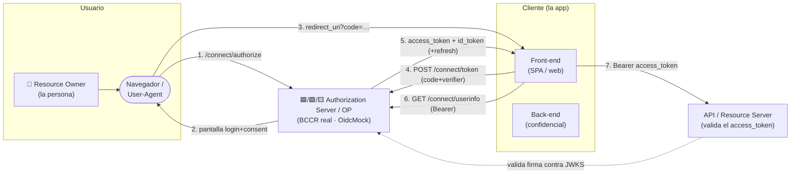
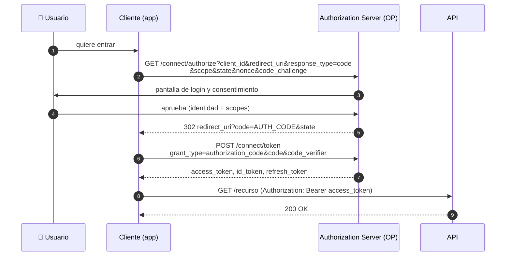

# Serie: el flujo OpenID Connect explicado (teoría · servidor real · OidcMock)

Esta serie documenta **cómo funciona OpenID Connect (OIDC)**. Cada documento cuenta lo mismo tres
veces, con la misma lupa:

| Plano | Qué cuenta | De dónde sale |
| --- | --- | --- |
| 🟦 **Teoría** | Cómo *debería* hacerse según los estándares | RFC 6749/6750/7009/7636/7662/8628/9126 y OpenID Connect Core 1.0 |
| 🟩 **Servidor real** | Cómo lo haría un Authorization Server en producción (el BCCR `oauth2.bccr.fi.cr`, estilo Duende IdentityServer) | el *discovery* de referencia que está en [`AGENTS.md`](../../AGENTS.md) + comportamiento observado |
| 🟨 **OidcMock** | Cómo *realmente* lo resuelve **este** mock | `src/OidcMock.Core`, `src/OidcMock.Host`, `config/*.json`, [`docs/decisions.md`](../decisions.md) |

La idea es que puedas leer cualquier documento de tres formas: para **entender** el protocolo, para
**maquetar** contra un IdP real sin sorpresas, y para **saber qué línea de código** hace ese trabajo en
el mock. Cuando el mock se desvía de la teoría o del servidor real, se dice **explícitamente** y se
enlaza la decisión (`D-0xx`) en [`docs/decisions.md`](../decisions.md).

## Cómo leer la serie

Empieza por **[01 · Actores y tokens](01-actores-y-tokens.md)** si vienes de cero. Si ya conoces OIDC,
el camino corto es **[03 · Authorization Code + PKCE](03-authorization-code-y-pkce.md)** →
**[05 · Token endpoint](05-token-endpoint-y-grants.md)** → **[11 · Matriz de paridad](11-matriz-de-paridad.md)**.
¿Con prisa? Ve directo al **[cheatsheet (12)](12-cheatsheet.md)** de una página.

| # | Documento | De qué va |
| --- | --- | --- |
| 01 | [Actores y tokens](01-actores-y-tokens.md) | Roles OAuth/OIDC, los cuatro tokens y la anatomía de un JWT |
| 02 | [Discovery y JWKS](02-discovery-y-jwks.md) | La metadata que publica el OP y las claves para validar firmas |
| 03 | [Authorization Code + PKCE](03-authorization-code-y-pkce.md) | El flujo principal, `state`, `nonce` y PKCE |
| 04 | [id_token y claims](04-id-token-y-claims.md) | Qué lleva el `id_token`, `at_hash`/`c_hash` y la proyección por `scope` |
| 05 | [Token endpoint y grants](05-token-endpoint-y-grants.md) | Canje del código, `refresh_token`, `client_credentials`, `password` y rotación |
| 06 | [UserInfo](06-userinfo.md) | El endpoint de claims del usuario y el reto `WWW-Authenticate` |
| 07 | [Introspection y revocation](07-introspection-y-revocation.md) | RFC 7662 / 7009 y el store de revocaciones |
| 08 | [Sesión y logout](08-sesion-y-logout.md) | Cookie de sesión, `prompt`, `end_session` y front-channel logout |
| 09 | [Flujo híbrido](09-flujo-hibrido.md) | `response_type=code id_token` y las rutas de entrada de GAUDI |
| 10 | [PAR, Device y CIBA](10-par-device-ciba.md) | Los flujos empujados y por sondeo (y qué está simulado) |
| 11 | [Matriz de paridad](11-matriz-de-paridad.md) | Tabla-resumen: teoría vs. real vs. mock, y mapa a código |
| 12 | [Cheatsheet](12-cheatsheet.md) | Todo lo esencial en una página: endpoints, tokens, errores y comandos |

## El mapa, de un vistazo

Quién habla con quién durante un login típico:

Y la secuencia completa del **Authorization Code Flow**, el flujo que sostiene todo lo demás:

## Fuentes de verdad

- Estándares: OAuth 2.0 (RFC 6749), Bearer (RFC 6750), Revocation (RFC 7009), PKCE (RFC 7636),
  Introspection (RFC 7662), Device (RFC 8628), PAR (RFC 9126) y **OpenID Connect Core 1.0**.
- Referencia del servidor real: el *discovery* del BCCR incluido en [`AGENTS.md`](../../AGENTS.md).
- Implementación: [`README.md`](../../README.md) (alcance y endpoints) y
  [`docs/decisions.md`](../decisions.md) (histórico con el porqué).

> Los diagramas usan **Mermaid**: se renderizan en GitHub, VS Code y muchos visores de Markdown.
